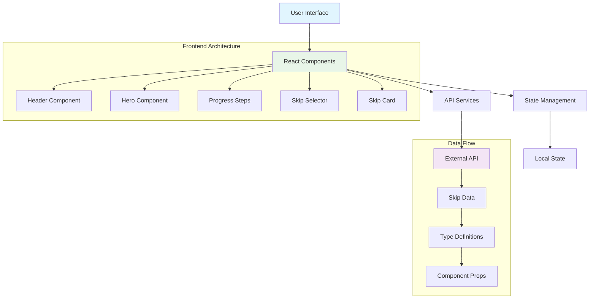
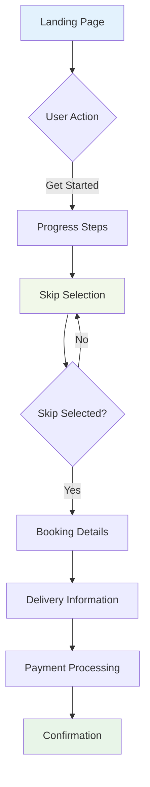

# SkipHire Pro - Modern Skip Hire Booking System

  [](https://reactjs.org/)
  [](https://www.typescriptlang.org/)
  [](https://tailwindcss.com/)
  [](https://vitejs.dev/)
  [](LICENSE)

## 🚀 Overview

SkipHire Pro is a modern, responsive web application for booking skip hire services. Built with React, TypeScript, and Tailwind CSS, it provides a seamless user experience for customers to select and book waste disposal solutions online.

### ✨ Key Features

- **🎨 Modern UI/UX**: Beautiful, responsive design with smooth animations
- **📱 Mobile-First**: Optimized for all devices and screen sizes
- **⚡ Real-time Data**: Integration with live skip availability API
- **🔍 Smart Selection**: Visual skip size comparison and selection
- **🛡️ Road Legal Indicators**: Clear badges for permit requirements
- **💳 Streamlined Booking**: Multi-step booking process with progress tracking
- **🎯 Professional Design**: Apple-level design aesthetics with attention to detail

## 🏗️ Architecture Overview



## 🔄 User Journey Flow



## 🛠️ Technology Stack

### Frontend
- **React 18.3.1** - Modern React with hooks and functional components
- **TypeScript 5.5.3** - Type-safe development
- **Tailwind CSS 3.4.1** - Utility-first CSS framework
- **Vite 5.4.2** - Fast build tool and development server

### Libraries & Tools
- **Lucide React** - Beautiful, customizable icons
- **Axios** - HTTP client for API requests
- **ESLint** - Code linting and quality assurance
- **PostCSS** - CSS processing and optimization

### Development Tools
- **Hot Module Replacement** - Instant development feedback
- **TypeScript Strict Mode** - Enhanced type checking
- **Responsive Design** - Mobile-first approach

## 📁 Project Structure

```
src/
├── components/           # Reusable UI components
│   ├── Header.tsx       # Navigation and branding
│   ├── Hero.tsx         # Landing page hero section
│   ├── ProgressSteps.tsx # Booking progress indicator
│   ├── SkipSelector.tsx # Main skip selection interface
│   └── SkipCard.tsx     # Individual skip display card
├── services/            # API and external service integrations
│   └── skipService.ts   # Skip data fetching logic
├── types/               # TypeScript type definitions
│   └── skip.ts          # Skip-related type interfaces
├── App.tsx              # Main application component
├── main.tsx             # Application entry point
└── index.css            # Global styles and Tailwind imports
```

## 🚀 Getting Started

### Prerequisites

- **Node.js** (version 18 or higher)
- **npm** or **yarn** package manager

### Installation

1. **Clone the repository**
   ```bash
   git clone https://github.com/engyahmed7/waste-management.git
   cd waste-management
   ```

2. **Install dependencies**
   ```bash
   npm install
   ```

3. **Start the development server**
   ```bash
   npm run dev
   ```

4. **Open your browser**
   Navigate to `http://localhost:5173`

### Build for Production

```bash
npm run build
```

## 🔌 API Integration

The application integrates with the WeWantWaste API to fetch real-time skip availability:

### Endpoint
```
GET https://app.wewantwaste.co.uk/api/skips/by-location
```

### Parameters
- `postcode`: Target postcode (default: "NR32")
- `area`: Target area (default: "Lowestoft")

### Response Structure
```typescript
interface Skip {
  id: string;
  name: string;
  size: string;
  price_before_vat: number;
  hire_period_days: string;
  allowed_on_road?: boolean;
  image_url?: string;
  description?: string;
}
```

## 🎯 Key Features Deep Dive

### 1. Responsive Design
- **Mobile-first approach** with breakpoints for tablet and desktop
- **Flexible grid layouts** that adapt to screen size
- **Touch-friendly interactions** for mobile users

### 2. Visual Skip Selection
- **3D-style skip illustrations** with hover effects
- **Size badges** for quick identification
- **Road legal indicators** with permit requirement warnings
- **Smooth animations** and micro-interactions

### 3. Progress Tracking
- **Visual progress indicators** showing booking steps
- **Contextual navigation** with back/forward controls
- **State persistence** throughout the booking process

### 4. Professional UI/UX
- **Gradient backgrounds** and modern color schemes
- **Consistent spacing** using 8px grid system
- **Typography hierarchy** with proper contrast ratios
- **Loading states** and error handling

## 🔧 Development Guidelines

### Code Style
- **Functional components** with React hooks
- **TypeScript strict mode** for type safety
- **ESLint configuration** for code quality
- **Consistent naming conventions** (camelCase, PascalCase)

### Component Design Principles
- **Single Responsibility** - Each component has one clear purpose
- **Reusability** - Components are designed for reuse
- **Props Interface** - Clear TypeScript interfaces for all props
- **Error Boundaries** - Graceful error handling

### Performance Optimizations
- **Code splitting** with dynamic imports
- **Optimized images** with proper sizing
- **Efficient re-renders** with proper dependency arrays
- **Bundle optimization** with Vite

## 🤝 Contributing

1. **Fork the repository**
2. **Create a feature branch** (`git checkout -b feature/amazing-feature`)
3. **Commit your changes** (`git commit -m 'Add amazing feature'`)
4. **Push to the branch** (`git push origin feature/amazing-feature`)
5. **Open a Pull Request**
